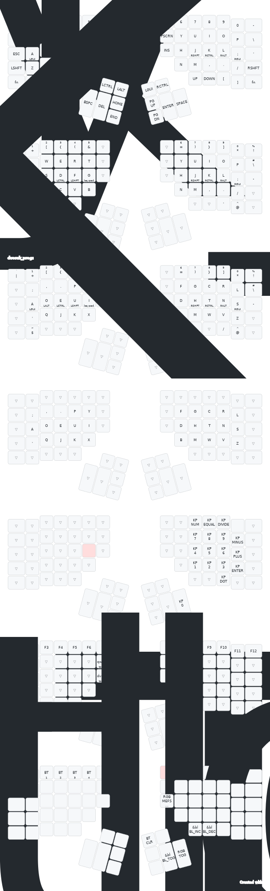

# Kinesis Advantage 360 Pro ZMK Config

## Features

- [x] Home row mods
- [x] Programmer Qwerty
- [x] Dvorak
- [x] Programmer Dvorak

## Layers Preview



## Building the Firmware with GitHub Actions

### Setup

1. Fork this repo.
2. Enable GitHub Actions on your fork.

### Build firmware

1. Push a commit to trigger the build.
2. Download the artifact.

## Building the Firmware in a local container

### Setup

#### Software

- Either Podman or Docker is required, Podman is chosen if both are installed.
- Make is also required

#### Windows specific

- If compiling on Windows use WSL2 and Docker [Docker Setup Guide](https://docs.docker.com/desktop/windows/wsl/).
- Install make using `sudo apt-get install make` inside the WSL2 instance.
- The repository can be cloned directly into the WSL2 instance or accessed through the C: mount point WSL provides by default (`/mnt/c/path-to-repo`).

#### macOS specific

On macOS [brew](https://brew.sh) can be used to install the required components.

- docker
- [colima](https://github.com/abiosoft/colima) can be used as the docker engine

```shell
brew install docker colima
colima start
```

> Note: On Apple Silicon (ARM based) systems you need to make sure to start colima with the correct architecture for the container being used.
>
> ```
> colima start --arch x86_64
> ```

#### Ubuntu/Debian specific

```shell
sudo apt-get install docker make
```

### Building the firmware

1. Execute `make` to build firmware for both halves or `make left` to only build firmware for the left hand side.
2. Check the `firmware` directory for the latest firmware build. The first part of the filename is the timestamp when the firmware was built.

### Cleanup

The built docker container and compiled firmware files can be deleted with `make clean`. This might be necessary if you updated your fork from V2.0 to V3.0 and are encountering build failures.

Creating the docker container takes some time. Therefore `make clean_firmware` can be used to only clean firmware without removing the docker container. Similarly `make clean_image` can be used to remove the docker container without removing compiled firmware files.

## Flashing firmware

Follow the programming instruction on page 8 of the [Quick Start Guide](https://kinesis-ergo.com/wp-content/uploads/Advantage360-Professional-QSG-v8-25-22.pdf) to flash the firmware.

### Overview

1. Extract the firmwares from the archive downloaded from the GitHub build job (If using the cloud builder) or the firmware folder (If building locally).
1. Connect the left side keyboard to USB.
1. Press Mod+macro1 to put the left side into bootloader mode; it should attach to your computer as a USB drive.
1. Copy `left.uf2` to the USB drive and it will disconnect.
1. Power off both keyboards (by unplugging them and making sure the switches are off).
1. Turn on the left side keyboard with the switch.
1. Connect the right side keyboard to USB to power it on.
1. Press Mod+macro3 to put the right side into bootloader mode to attach it as a USB drive.
1. Copy `right.uf2` to the mounted drive.
1. Unplug the right side keyboard and turn it back on.
1. Enjoy!

> Note: There are also physical reset buttons on both keyboards which can be used to enter and exit the bootloader mode. Their location is described in section 2.7 on page 9 in the [User Manual](https://kinesis-ergo.com/wp-content/uploads/Advantage360-ZMK-KB360-PRO-Users-Manual-v3-10-23.pdf) and use is described in section 5.9 on page 14.

> Note: Some operating systems wont always treat the drive as ejected after the settings-reset file is flashed or may throw a spurious error, this doesn't mean that the flashing process has failed.
